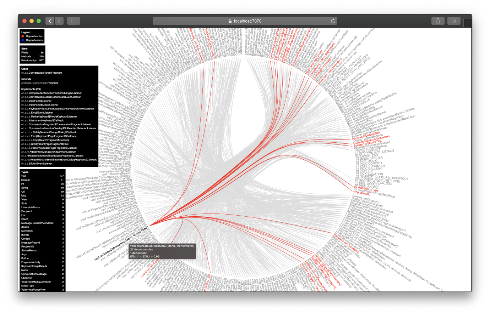

# Tumbleweed

Understand and break down large classes without breaking a sweat 😓

## Screenshot



## Quick start

Build the project first and then run the command line tool.

```bash
$ twd view io.redgreen.ExampleClass
```

The command will start a web server on port 7070. Go to `localhost:7070` in your browser to see the diagram.

For more options, run `twd --help`.

## Known issues

- The tool does not work well with classes with lambda expressions and anonymous classes. This is something I am working
  on actively to fix. This has to do with the special characters in the class names and
  the [edge bundling graph](https://observablehq.com/@d3/bilevel-edge-bundling) source code that I am using.

- Kotlin classes have synthetic methods that are not visible in the source code. These methods are shown in the
  diagram. This is yet another limitation of the tool at the moment.

## Licenses

```
Copyright (c) 2022-Present, Ragunath Jawahar

Licensed under the Apache License, Version 2.0 (the "License");
you may not use this file except in compliance with the License.
You may obtain a copy of the License at

   http://www.apache.org/licenses/LICENSE-2.0

Unless required by applicable law or agreed to in writing, software
distributed under the License is distributed on an "AS IS" BASIS,
WITHOUT WARRANTIES OR CONDITIONS OF ANY KIND, either express or implied.
See the License for the specific language governing permissions and
limitations under the License.
```

```
Copyright 2018–2020 Observable, Inc.

Permission to use, copy, modify, and/or distribute this software for any
purpose with or without fee is hereby granted, provided that the above
copyright notice and this permission notice appear in all copies.

THE SOFTWARE IS PROVIDED "AS IS" AND THE AUTHOR DISCLAIMS ALL WARRANTIES
WITH REGARD TO THIS SOFTWARE INCLUDING ALL IMPLIED WARRANTIES OF
MERCHANTABILITY AND FITNESS. IN NO EVENT SHALL THE AUTHOR BE LIABLE FOR
ANY SPECIAL, DIRECT, INDIRECT, OR CONSEQUENTIAL DAMAGES OR ANY DAMAGES
WHATSOEVER RESULTING FROM LOSS OF USE, DATA OR PROFITS, WHETHER IN AN
ACTION OF CONTRACT, NEGLIGENCE OR OTHER TORTIOUS ACTION, ARISING OUT OF
OR IN CONNECTION WITH THE USE OR PERFORMANCE OF THIS SOFTWARE.
```
