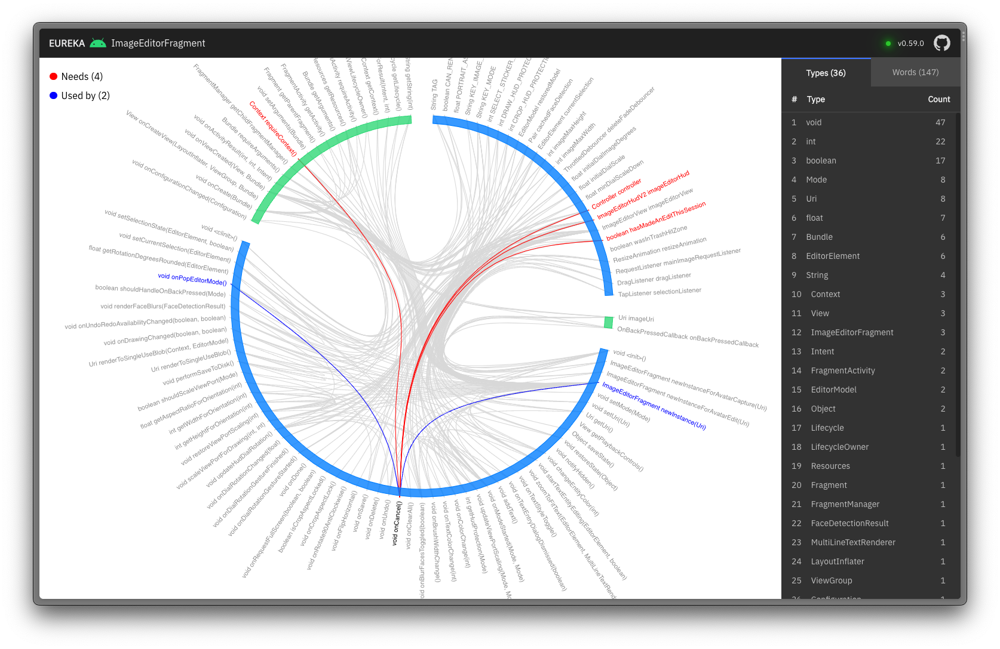
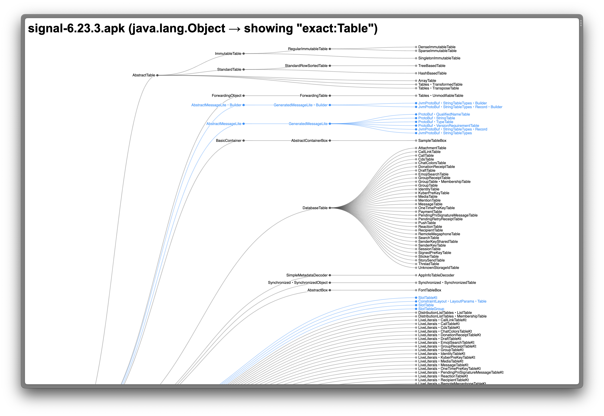
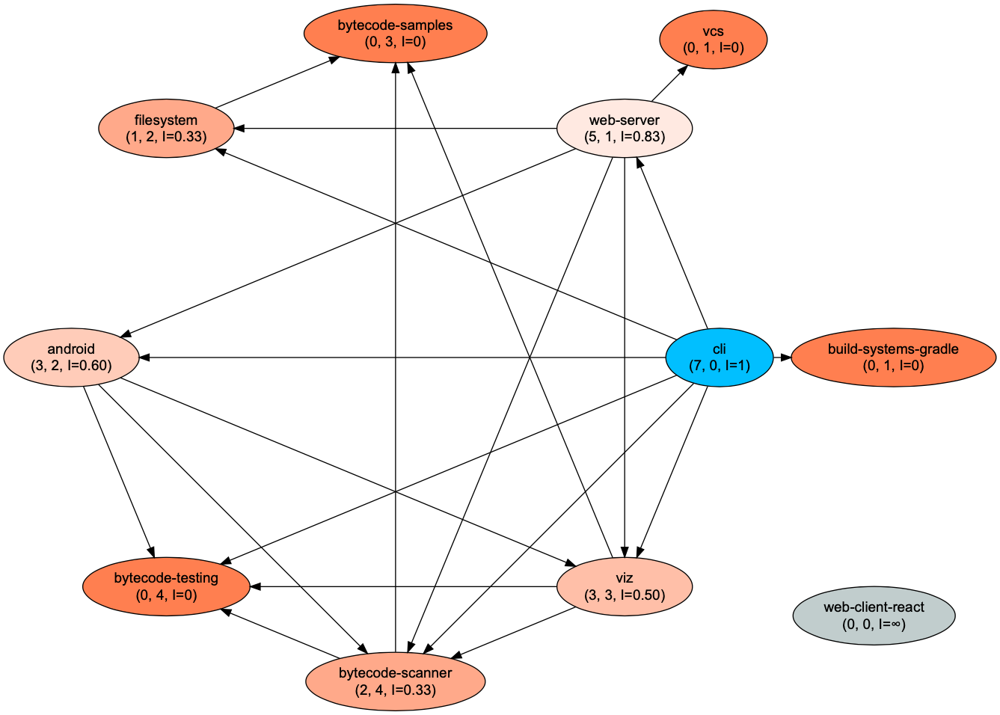

# Eureka  

Breakthrough tooling to work with Kotlin and Java codebases 🚀

## 🏎️ Installation

```bash
brew install legacycodehq/tap/eureka
```

## 🎉 Updates

```bash
brew upgrade eureka
```

## Live demo

You can try this [sample interactive graph](https://redgreenio.github.io/) for Signal Android
App's [StoryViewerPageFragment](https://github.com/signalapp/Signal-Android/blob/ff8f9ca81ae6a25e1e946612c817206b9410d9a1/app/src/main/java/org/thoughtcrime/securesms/stories/viewer/page/StoryViewerPageFragment.kt)
class.

## Features

### 1. Class visualization

**⚠️ Important:** You must first build the project and then run the `watch` subcommand.

The command will start a web server on port 7070. Go to `localhost:7070` in your browser to see the diagram. The diagram
updates in real-time as you make changes to the source code and compile the project.



#### Usage

```bash
eureka watch StoryViewerPageFragment
```

#### Usage (Android, experimental and recommended)

```bash
eureka watch -x android StoryViewerPageFragment
```

Read [this blog post](https://legacycode.com/android-support) to learn how to use this feature when examining Android
classes.

For more options, run `eureka watch --help`.

### 2. Class inheritance hierarchy visualization (experimental)



#### Usage (Android)

```bash
eureka hierarchy signal-6.23.3.apk -n androidx.fragment.app.Fragment
```

#### Usage (JVM artifacts)

```bash
eureka hierarchy truth-1.1.5.jar -n com.google.common.truth.Subject
```

Visit `localhost:7090` in your browser to see the diagram.

#### Pruning

Visualizing class hierarchies as trees is a useful way to understand complex structures in software. Sometimes, these
trees can become quite large, making it difficult to find relevant information. To address this, we offer a feature that
allows you to 'prune' these trees by specifying certain keywords.

Pruning in this context means reducing the size of the tree to only include nodes that match the given keyword, or have
descendants that match the keyword. This feature can significantly reduce the complexity of the tree, making it easier
to navigate and understand.

To use this feature, you simply adjust the URL of your tree visualization by providing a prune parameter. For example,

`http://localhost:7090/?class=androidx.fragment.app.Fragment&prune=Payment`

### 3. Navigation flows between screens


#### Usage

```bash
eureka flows wikipedia.apk
```

Visit `localhost:7090` in your browser to see the diagram.

### 4. List files with highest LOC

#### Usage (default, searches Kotlin and Java sources)

```bash
eureka top 10
```

#### Output

```
Showing 10 of 140
-----------------
 1. bytecode/scanner/src/test/kotlin/com/legacycode/eureka/ClassScannerKotlinTest.kt   321
 2. bytecode/scanner/src/main/kotlin/com/legacycode/eureka/ClassScanner.kt             303
 3. bytecode/scanner/src/main/kotlin/com/legacycode/eureka/ClassStructure.kt           232
 4. vcs/src/test/kotlin/com/legacycode/eureka/vcs/blame/BlameLineTest.kt               183
 5. web-server/src/main/kotlin/com/legacycode/eureka/web/WatchServer.kt                149
 6. bytecode/scanner/src/test/kotlin/com/legacycode/eureka/ClassScannerJavaTest.kt     126
 7. build-systems/gradle/src/main/kotlin/com/legacycode/eureka/gradle/Run.kt           117
 8. web-server/src/main/kotlin/com/legacycode/eureka/web/ownership/OwnershipServer.kt  117
 9. bytecode/scanner/src/test/kotlin/com/legacycode/eureka/QualifiedTypeTest.kt        114
10. bytecode/scanner/src/main/kotlin/com/legacycode/eureka/MethodDescriptor.kt         96 
```

#### Usage (specify extensions)

```bash
eureka top 10 --ext cpp,swift
```

### 5. File ownership (experimental)


#### Usage

```bash
eureka ownership
```

The command will start a web server on port 7080. Visit the app on `localhost:7080`.

#### Known issues

- Throws exceptions when visiting binary or empty files.

### 6. Module dependency diagram (experimental)



#### Usage

```bash
eureka modules ~/GitHubProjects/Signal-Android
```

The command will print a Graphviz directed graph DSL.

1. Copy the DSL and paste it into the [online Graphviz tool](https://dreampuf.github.io/GraphvizOnline).
2. The tool selects the **dot** engine by default, for best results use the **circo** engine from the engine dropdown.

## Licenses

```
Copyright (c) 2022-Present, Ragunath Jawahar

Licensed under the Apache License, Version 2.0 (the "License");
you may not use this file except in compliance with the License.
You may obtain a copy of the License at

   http://www.apache.org/licenses/LICENSE-2.0

Unless required by applicable law or agreed to in writing, software
distributed under the License is distributed on an "AS IS" BASIS,
WITHOUT WARRANTIES OR CONDITIONS OF ANY KIND, either express or implied.
See the License for the specific language governing permissions and
limitations under the License.
```

```
Copyright 2018–2020 Observable, Inc.

Permission to use, copy, modify, and/or distribute this software for any
purpose with or without fee is hereby granted, provided that the above
copyright notice and this permission notice appear in all copies.

THE SOFTWARE IS PROVIDED "AS IS" AND THE AUTHOR DISCLAIMS ALL WARRANTIES
WITH REGARD TO THIS SOFTWARE INCLUDING ALL IMPLIED WARRANTIES OF
MERCHANTABILITY AND FITNESS. IN NO EVENT SHALL THE AUTHOR BE LIABLE FOR
ANY SPECIAL, DIRECT, INDIRECT, OR CONSEQUENTIAL DAMAGES OR ANY DAMAGES
WHATSOEVER RESULTING FROM LOSS OF USE, DATA OR PROFITS, WHETHER IN AN
ACTION OF CONTRACT, NEGLIGENCE OR OTHER TORTIOUS ACTION, ARISING OUT OF
OR IN CONNECTION WITH THE USE OR PERFORMANCE OF THIS SOFTWARE.
```
