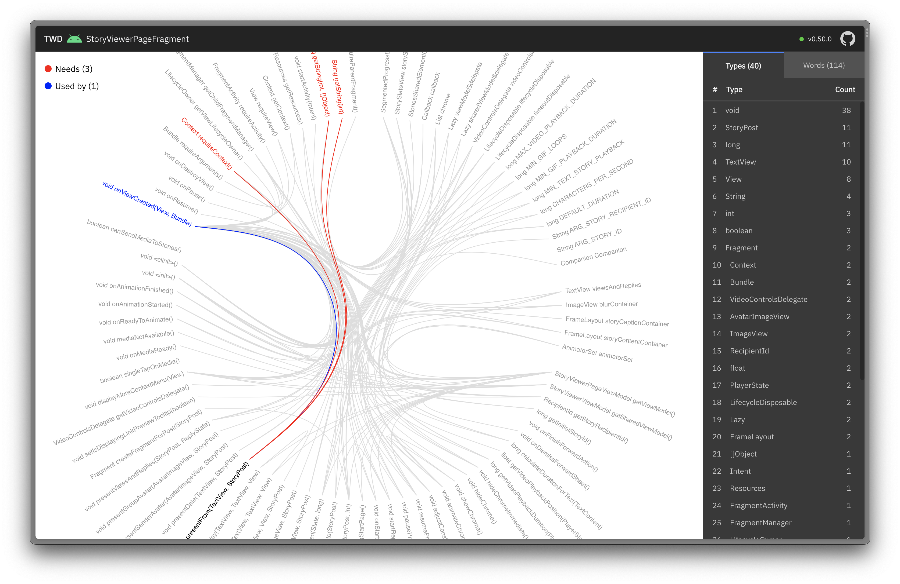

# Tumbleweed (early preview)  

Effortlessly understand and analyze Kotlin/Java classes in your codebase 😎

## Is this for me?

- You constantly feel that there's something off with the design but can't articulate it well to your team members.
- You have joined a new team or an organization and want to understand the codebase.
- You have this one class that you can't understand because it's way too large, and the previous maintainers have
  left the team or organization.
- You want to contribute to an open-source project to build your portfolio.
- You are curious about how well your codebase is designed and want to know how you could improve it.
- You are refactoring a class and want to identify clusters so that you can extract them into smaller classes.
- You want to analyze the codebase to identify code smells and refactor them.

If you have any of these requirements, then this tool is for you 😉

## Live demo

You can try this [sample interactive graph](https://redgreenio.github.io/) for Signal Android
App's [StoryViewerPageFragment](https://github.com/signalapp/Signal-Android/blob/ff8f9ca81ae6a25e1e946612c817206b9410d9a1/app/src/main/java/org/thoughtcrime/securesms/stories/viewer/page/StoryViewerPageFragment.kt)
class.

## Screenshots

### Class visualization—edge bundling graph

Visualizing [ConversationParentFragment.java](https://github.com/signalapp/Signal-Android/blob/ff8f9ca81ae6a25e1e946612c817206b9410d9a1/app/src/main/java/org/thoughtcrime/securesms/conversation/ConversationParentFragment.java)—a **3,510 LOC** class from the Signal Android App.



### File ownership—treemap


## Installation

```bash
brew install legacycodehq/tap/twd
```

## Updates

```bash
brew upgrade twd
```

## Quick start

Build the project first and then run the command line tool.

```bash
twd watch com.legacycode.ExampleClass
```

The command will start a web server on port 7070. Go to `localhost:7070` in your browser to see the diagram.

The diagram will be updated in real-time as you make changes to the source code and compile the project.

For more options, run `twd watch --help`.

## Licenses

```
Copyright (c) 2022-Present, Ragunath Jawahar

Licensed under the Apache License, Version 2.0 (the "License");
you may not use this file except in compliance with the License.
You may obtain a copy of the License at

   http://www.apache.org/licenses/LICENSE-2.0

Unless required by applicable law or agreed to in writing, software
distributed under the License is distributed on an "AS IS" BASIS,
WITHOUT WARRANTIES OR CONDITIONS OF ANY KIND, either express or implied.
See the License for the specific language governing permissions and
limitations under the License.
```

```
Copyright 2018–2020 Observable, Inc.

Permission to use, copy, modify, and/or distribute this software for any
purpose with or without fee is hereby granted, provided that the above
copyright notice and this permission notice appear in all copies.

THE SOFTWARE IS PROVIDED "AS IS" AND THE AUTHOR DISCLAIMS ALL WARRANTIES
WITH REGARD TO THIS SOFTWARE INCLUDING ALL IMPLIED WARRANTIES OF
MERCHANTABILITY AND FITNESS. IN NO EVENT SHALL THE AUTHOR BE LIABLE FOR
ANY SPECIAL, DIRECT, INDIRECT, OR CONSEQUENTIAL DAMAGES OR ANY DAMAGES
WHATSOEVER RESULTING FROM LOSS OF USE, DATA OR PROFITS, WHETHER IN AN
ACTION OF CONTRACT, NEGLIGENCE OR OTHER TORTIOUS ACTION, ARISING OUT OF
OR IN CONNECTION WITH THE USE OR PERFORMANCE OF THIS SOFTWARE.
```
